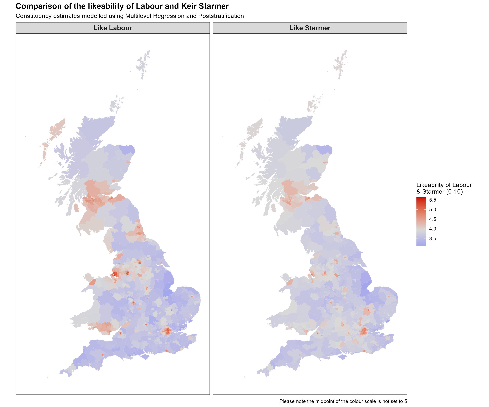
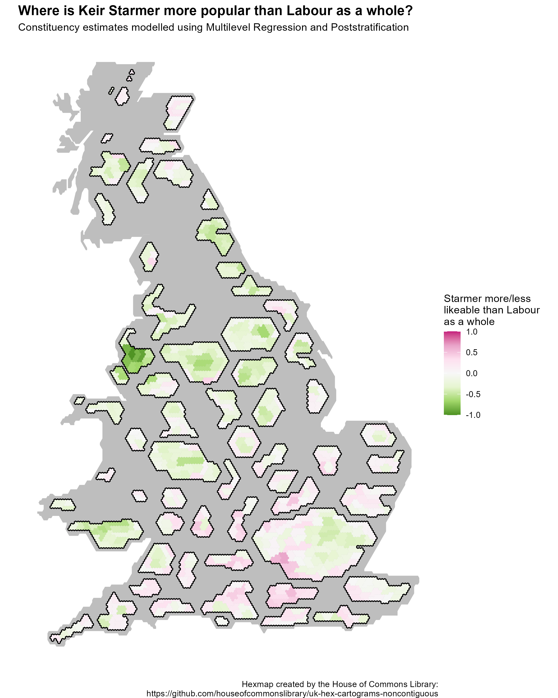

# Multilevel Regression and Poststratification (MRP)

## Example 1: Keir Starmer's Likeability

## Useful links:

Intros to MRP:

-   [Multilevel Regression and Poststratification Case Studies (bookdown.org)](https://bookdown.org/jl5522/MRP-case-studies/)

-   [An Introduction to Multilevel Regression and Post-Stratification for Estimating Constituency Opinion - Chris Hanretty, 2020 (sagepub.com)](https://journals.sagepub.com/doi/10.1177/1478929919864773) (also shows useful code in the supplementary materials)

Dynamic MRP:

-   <http://www.stat.columbia.edu/~gelman/research/unpublished/MRT(1).pdf>

Interesting Papers:

-   [Forecasting elections with non-representative polls (microsoft.com)](https://www.microsoft.com/en-us/research/wp-content/uploads/2016/04/forecasting-with-nonrepresentative-polls.pdf)
-   [Deep Interactions with MRP: Election Turnout and Voting Patterns Among Small Electoral Subgroups (columbia.edu)](http://www.stat.columbia.edu/~gelman/research/published/misterp.pdf)

Helpful code :

-   [philswatton/mrpLR (github.com)](https://github.com/philswatton/mrpLR) (especially useful script for making poststratification frames using survey raking)
