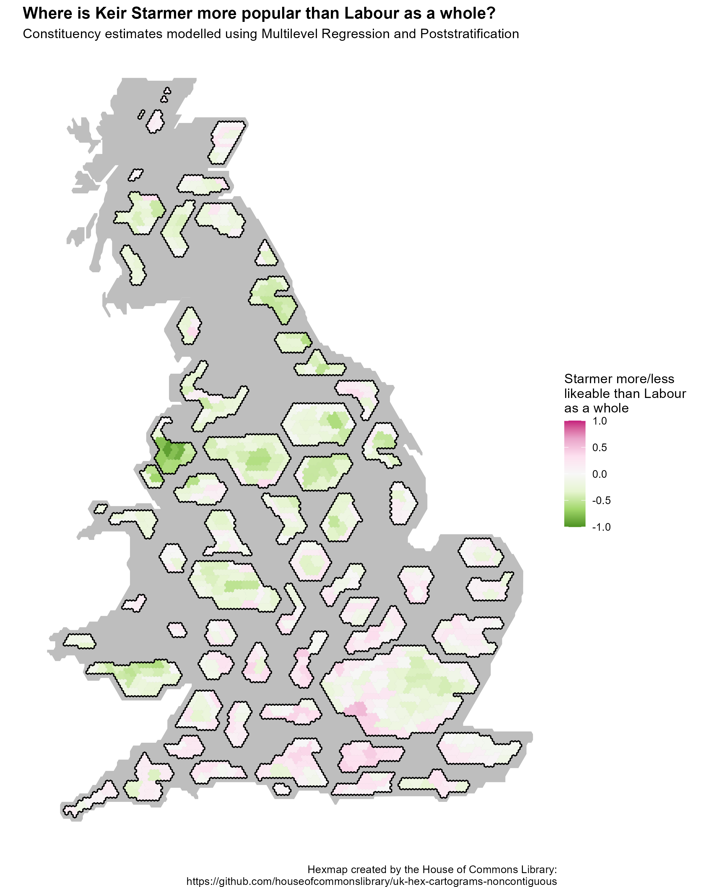

# Multilevel Regression and Poststratification (MRP)

## Intro

Multilevel Regression and Poststratification (MRP or MrP) is an increasingly utilized method to make inferences about a target population from survey data that may not be representative of the target population.

MRP therefore has two primary uses. Firstly, MRP is used to correct for biased samples, for example, previous research has used MRP to predict the results of US elections from a poll of Xbox users (a highly unrepresentative sample of the US population).

Secondly, MRP is used for small area estimation. In 2017, YouGov introduced MRP to the UK polling industry by using the method to successfully measure voting intention at a constituency level using only a singular national poll with a small number of responses in each constituency. They were one of the few pollsters that pointed to the likely shrinking of the Conservative majority.

The following examples show some of my implementations of MRP to investigate social and political questions that I find interesting.

## Example 1: Where is Keir Starmer's an electoral asset to Labour?

How popular is Keir Starmer and where in the UK is he an electoral asset? The following example uses MRP on the latest British Election Study wave to measure his likeability by constituency and contrasts it with the likeability of the Labour Party more broadly.

To take a better look at where Starmer outperforms and underperforms Labour the map below shows areas where Starmer underperforms in green and where Starmer outperforms Labour in purple. Starmer appears to be an electoral asset outside of traditional Labour's territory, outperforming Labour in the rural constituencies of the South of England - the Conservative's so called 'Blue Wall'.

In traditional Labour areas, Starmer is less popular than the Labour Party, this is especially true in the North West where Starmer is significantly less popular than Labour. Discerningly for Labour, in a lot of the target 'Red Wall' seats Starmer also is a potential electoral liability.

Differences in attitudes towards Labour and Starmer by age are dramatic. Especially among those under 30, Starmer is far less popular than Labour as a whole in nearly every constituency. When age reaches the above 60 categories the trend reverses and Starmer is generally more popular then the Labour Party as a whole.

## Useful links:

Intros to MRP:

-   [Multilevel Regression and Poststratification Case Studies (bookdown.org)](https://bookdown.org/jl5522/MRP-case-studies/)

-   [An Introduction to Multilevel Regression and Post-Stratification for Estimating Constituency Opinion - Chris Hanretty, 2020 (sagepub.com)](https://journals.sagepub.com/doi/10.1177/1478929919864773) (also shows useful code in the supplementary materials)

Dynamic MRP:

-   <http://www.stat.columbia.edu/~gelman/research/unpublished/MRT(1).pdf>

Interesting Papers:

-   [Forecasting elections with non-representative polls (microsoft.com)](https://www.microsoft.com/en-us/research/wp-content/uploads/2016/04/forecasting-with-nonrepresentative-polls.pdf)
-   [Deep Interactions with MRP: Election Turnout and Voting Patterns Among Small Electoral Subgroups (columbia.edu)](http://www.stat.columbia.edu/~gelman/research/published/misterp.pdf)

Helpful code :

-   [philswatton/mrpLR (github.com)](https://github.com/philswatton/mrpLR) (especially useful script for making poststratification frames using survey raking)
