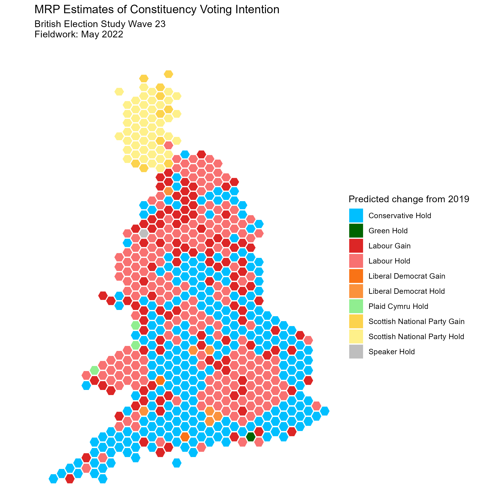

# Multilevel Regression and Poststratification (MRP)

## Intro

Multilevel Regression and Poststratification (MRP or MrP) is an increasingly utilised method in survey research to make inferences about a target population from survey data that may not be representative of the target population.

MRP therefore has two primary uses. Firstly, MRP is used to correct for biased samples, for example, previous research has used MRP to predict the results of US elections from a [poll of Xbox users](https://www.microsoft.com/en-us/research/wp-content/uploads/2016/04/forecasting-with-nonrepresentative-polls.pdf) (a highly unrepresentative sample of the US population).

Secondly, MRP is used for small area estimation. In 2017, [YouGov introduced MRP](https://yougov.co.uk/topics/politics/articles-reports/2017/06/09/how-yougovs-election-model-compares-final-result) to the UK polling industry by using the method to successfully measure voting intention at a constituency level from a single (albeit large) national poll with only a small number of responses in each constituency. They were one of the few pollsters that pointed to the likely shrinking of the Conservative majority.

The following examples show some of my experiments with MRP to investigate social and political questions that I find interesting.

## [Example 1: Estimating constituency voting intention using MRP](https://github.com/hymeram/mrp/tree/main/1.voting_intention)

In the UK, politics is decided at the local level with elections occurring within constituencies, wards, and other electoral units. However - while elections occur locally - political polling tends to be national. Most polsters look to interview a 'nationally representative sample' of around 1000 respondents. While this gives a respectable margin of error at the national level we can't get reliable estimates for individual electoral units because of small sample sizes and the fact the sample is unlikely to be representative of the smaller units. Because of this, traditional polling can only give us a broad picture of how many seats each party would win if there were to be an election (using simple models like National Uniform Swing).

In an ideal world pollsters would instead poll each electoral unit, however, such an approach is prohibitively expensive as it would require tens, if not hundreds, of thousands of interviews to get respectable margins of error. MRP was adopted as a method to get around this problem, using a large national polls (normally of around 10,000) to predict small area outcomes.

The following example shows my implementation of MRP to measure constituency level voting intention using the latest wave of the British Election Study's panel (fieldwork conducted in May 2022). The methodology is broadly similar to that laid out by [Lauderdale et al (2017)](https://benjaminlauderdale.net/files/papers/mrp-polling-paper.pdf) - several of the authors of the paper are themselves involved with MRP work on behalf of UK pollsters e.g [Jack Blumenau for Opinium](https://www.opinium.com/wp-content/uploads/2022/10/MRP_Tables_2022.pdf), and [Ben Lauderdale,](https://yougov.co.uk/topics/politics/articles-reports/2019/11/27/how-yougovs-2019-general-election-model-works) [Delia Bailey & Doug Rivers for YouGov.](https://today.yougov.com/topics/politics/articles-reports/2020/11/03/yougov-2020-mrp-model-forecasts?amp;amp=)

At a national level, MRP estimates voting intention broadly in-line with the weighted BES estimates (all separated by less than a percentage point). However, when you account for which demographic groups are likely to turnout to vote (likely turnout modeled from 2015 and 2017 BES data), Labour's estimated vote share drops while Conservative vote share increases.

#### MRP Seat Estimates of BES Voting Intention (May 2022)

|      Party       | Weighted Survey Estimate | MRP Estimate | Turnout Adjusted MRP Estimate | MRP Seat Estimate |
|:----------------:|:------------------------:|:------------:|:-----------------------------:|:-----------------:|
|      Labour      |          38.2%           |    39.0%     |             37.7%             |        326        |
|   Conservative   |          30.4%           |    30.0%     |             31.6%             |        237        |
|       SNP        |           4.0%           |     4.2%     |             4.0%              |        58         |
| Liberal Democrat |          10.4%           |    10.0%     |             10.3%             |         7         |
|   Plaid Cymru    |           0.6%           |     0.7%     |             0.7%              |         2         |
|   Green Party    |           6.7%           |     6.2%     |             6.2%              |         1         |
|    Reform UK     |           3.7%           |     4.0%     |             4.1%              |         0         |
|      Other       |           5.9%           |     6.0%     |             5.4%              |         1         |

In terms of Parliamentary seats, Labour is estimated to achieve a small majority of 326 seats with the Conservatives down on 237. The map below shows Labour regaining much of the North of England, Wales and sweeping the Conservatives from London. The two main party results seem sensible given the vote shares and broadly aligns with [MRP analysis by Focaldata](https://www.bestforbritain.org/may_2022_mrp_analysis) from around that time.

Where I'm less confident in the model is the estimates for the smaller parties, It seems unlikely to me that the SNP would nearly take every seat in Scotland including areas like Orkney and Shetland. Similarly, the number of seats for Plaid Cymru and the Liberal Democrats maybe underestimated. One potential solution to this would be to allow the effect of individual predictors to vary by region.

One of the most interesting aspects of MRP is that estimates can be analysed by demographic subgroup, where that would have been impossible (highly unreliable) with traditional polling. The maps below show the party with the most support for each constituency by level of education. As you can see, education is strongly associated with voting intention with Labour and the Liberal Democrats performing very strongly among those with a degree and the Conservatives performing strongly for those without qualifications.

## [Example 2: Where is Keir Starmer an electoral asset to Labour?](https://github.com/hymeram/mrp/tree/main/2.starmer_likeability)

How popular is Keir Starmer and where in the UK is he an electoral asset? The following example uses MRP on the latest British Election Study wave to measure his likeability by constituency and contrasts it with the likeability of the Labour Party more broadly.

To take a better look at where Starmer outperforms and underperforms Labour the map below shows areas where Starmer is more/less popular than the Labour Party. Starmer appears to be an electoral asset to Labour in areas outside of traditional Labour's territory, i.e. the rural South of England.

In Labour heartlands, Starmer is less popular than the Labour Party, this is especially true in the North West, the part of the UK where Starmer is least liked. Disconcertingly for Labour, in a lot of the target 'Red Wall' seats Starmer also appears less popular than the Labour Party as an organisation, potentially hindering Labour performance in this part of the UK.

Differences in attitudes towards Labour and Starmer by age are dramatic. Especially among those under 30, Starmer is substantially less liked than Labour as a whole in nearly every constituency. Among those over the age of 60, Starmer is generally more popular then the Labour Party as a whole, apart from a few areas of the UK (including much of North West England and South Wales).

## Useful links:

-   [Multilevel Regression and Poststratification Case Studies](https://bookdown.org/jl5522/MRP-case-studies/)

-   [An Introduction to Multilevel Regression and Post-Stratification for Estimating Constituency Opinion](https://journals.sagepub.com/doi/10.1177/1478929919864773)

-   [Forecasting elections with non-representative polls](https://www.microsoft.com/en-us/research/wp-content/uploads/2016/04/forecasting-with-nonrepresentative-polls.pdf)

-   [Deep Interactions with MRP: Election Turnout and Voting Patterns Among Small Electoral Subgroups](http://www.stat.columbia.edu/~gelman/research/published/misterp.pdf)

-   [The Geography of Racially Polarized Voting: Calibrating Surveys at the District Level](https://osf.io/mk9e6/)

-   [Using Multilevel Regression and Poststratification to Estimate Dynamic Public Opinion](http://www.stat.columbia.edu/~gelman/research/unpublished/MRT(1).pdf)

-   [Model-Based Pre-Election Polling for National and Sub-National Outcomes in the US and UK](https://benjaminlauderdale.net/files/papers/mrp-polling-paper.pdf)

-   [General Election Vote Intention: Multilevel regression and post-stratification (MRP) estimates](https://www.opinium.com/wp-content/uploads/2022/10/MRP_Tables_2022.pdf)

-   [Comparing Strategies for Estimating Constituency Opinion from National Survey Samples](https://www.cambridge.org/core/journals/political-science-research-and-methods/article/comparing-strategies-for-estimating-constituency-opinion-from-national-survey-samples/60701055350642BFA9BD5FF6EE469BC2#article)
