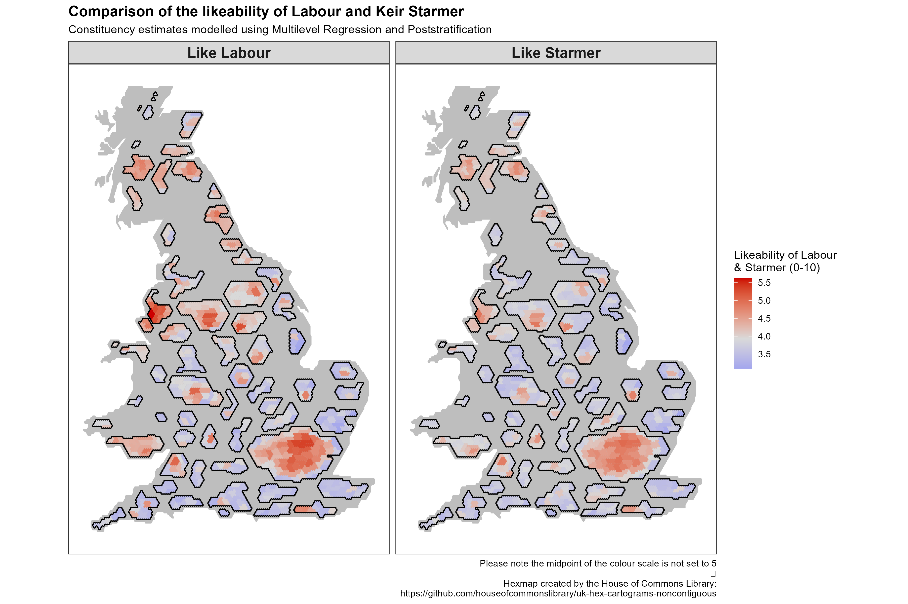

# Multilevel Regression and Poststratification (MRP)

## Intro 

Multilevel Regression and Poststratification (MRP or MrP) is an increasingly utilized method to make inferences about a target population from survey data that may not be representative of the target population.

MRP therefore has two primary uses. Firstly, MRP is used to correct for biased samples, for example, previous research has used MRP to correct for a heavily biased sample of Xbox users from which they were successfully able to predict the result of the US election.

Secondly, MRP is used for small area estimation (this is commonly to sub-geographies but it is also used for small population subgroups). In 2017, YouGov introduced MRP to the UK polling industry using the method to successfully measure public opinion at a constituency level on a national poll that only had a small number of responses in each constituency. They were one of the few pollsters that pointed to a likely shrinking of the Conservative majority.

The following examples show some of my implementations of MRP to investigate social and political questions that I find interesting.

## Example 1: Keir Starmer's Likeability

How popular is Keir Starmer and where is in the UK is he most popular? The following example uses MRP on the latest British Election Study wave to measure his likeability by constituency. The map below contrast this with the likeability of the Labour Party more generally, also estimated using MRP.

Both Keir and Labour more broadly are more popular in urban areas, although Labour more broadly seems more popular particularly in the North of England, South Wales, and the Central Belt of Scotland.

To look better at where Starmer outperforms or underperforms Labour in terms of popularity the map below shows areas where Starmer underperforms in Green and where Starmer ourperforms Labour in purple.

Starmer seems to be an electoral asset outside of Labour's traditional heartlands, outperforming Labour in the South of England and the Conservative's so called 'Blue Wall'.

In traditional Labour areas, Starmer is less popular than Labour more broadly, this is especially true in the North West where Starmer is an electoral drag on Labour. Discerningly for Labour, in a lot of the target 'Red Wall' seats Starmer also is a potential electoral liability.

Differences in attitudes towards Labour and Starmer by age are dramatic. Especially among those under 30, Starmer is far less popular than Labour as a whole in nearly every constituency. When age reaches the above 60 categories the trend reverses and Starmer is generally more popular then Labour.

## Useful links:

Intros to MRP:

-   [Multilevel Regression and Poststratification Case Studies (bookdown.org)](https://bookdown.org/jl5522/MRP-case-studies/)

-   [An Introduction to Multilevel Regression and Post-Stratification for Estimating Constituency Opinion - Chris Hanretty, 2020 (sagepub.com)](https://journals.sagepub.com/doi/10.1177/1478929919864773) (also shows useful code in the supplementary materials)

Dynamic MRP:

-   <http://www.stat.columbia.edu/~gelman/research/unpublished/MRT(1).pdf>

Interesting Papers:

-   [Forecasting elections with non-representative polls (microsoft.com)](https://www.microsoft.com/en-us/research/wp-content/uploads/2016/04/forecasting-with-nonrepresentative-polls.pdf)
-   [Deep Interactions with MRP: Election Turnout and Voting Patterns Among Small Electoral Subgroups (columbia.edu)](http://www.stat.columbia.edu/~gelman/research/published/misterp.pdf)

Helpful code :

-   [philswatton/mrpLR (github.com)](https://github.com/philswatton/mrpLR) (especially useful script for making poststratification frames using survey raking)
