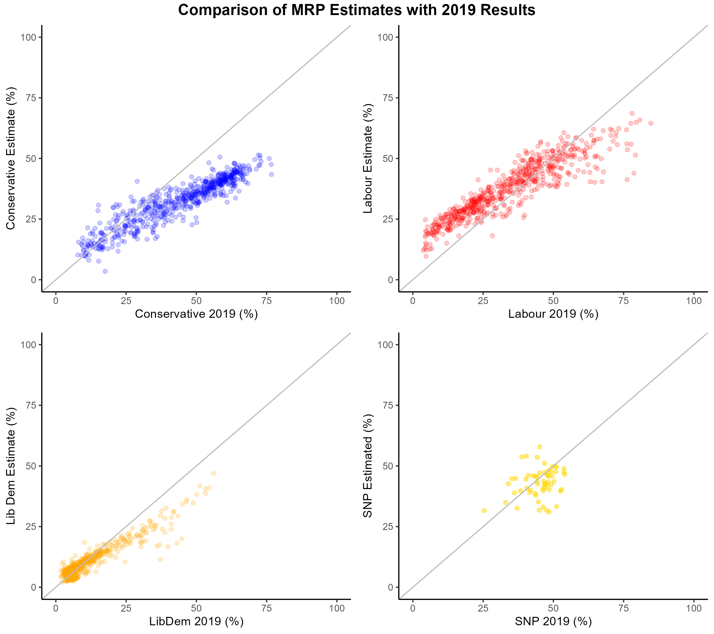

# Multilevel Regression and Poststratification (MRP)

## Intro

Multilevel Regression and Poststratification (MRP or MrP) is an increasingly utilised method in survey research to make inferences about a target population from survey data that may not be representative of the target population. MRP has two primary uses, to correct for biased survey samples and for small area estimation. The following examples show some of my experiments with MRP to investigate some of the social and political questions I find interesting.

## [Example 1: Estimating constituency voting intention using MRP](https://github.com/hymeram/mrp/tree/main/1.voting_intention)

The following example shows my implementation of MRP to measure constituency level voting intention using the latest wave of the British Election Study's panel (fieldwork conducted in May 2022). The methodology is broadly similar to that laid out by [Lauderdale et al (2017)](https://benjaminlauderdale.net/files/papers/mrp-polling-paper.pdf).

The table below shows that the MRP model estimates of national voting intention are similar to when using traditional survey weights (all results separated by less than a percentage point). When the MRP model accounts for which demographic groups are likely to turnout to vote - likely turnout modelled from 2015 and 2017 BES data - Labour's estimated vote share drops while Conservative vote share increases by over a percentage point.

#### MRP Seat Estimates of BES Voting Intention (May 2022)

|      Party       | Weighted Survey Estimate | MRP Estimate | Turnout Adjusted MRP Estimate | MRP Seat Estimate |
|:-------------:|:-------------:|:-------------:|:-------------:|:-------------:|
|      Labour      |          38.2%           |    38.1%     |             36.8%             |        325        |
|   Conservative   |          30.4%           |    30.5%     |             32.0%             |        234        |
|       SNP        |           4.0%           |     4.3%     |             4.1%              |        59         |
| Liberal Democrat |          10.4%           |    10.1%     |             10.4%             |         8         |
|   Plaid Cymru    |           0.6%           |     0.8%     |             0.8%              |         4         |
|   Green Party    |           6.7%           |     6.6%     |             6.5%              |         1         |
|    Reform UK     |           3.7%           |     4.2%     |             4.2%              |         0         |
|      Other       |           5.9%           |     5.5%     |             5.1%              |         1         |

In terms of Parliamentary seats, Labour is estimated to achieve a small majority in Parliament with the Conservatives having a large fall. The map below shows Labour regaining much of the North of England, Wales and sweeping the Conservatives from London.

The two main party results seem sensible given the vote shares and broadly aligns with [MRP analysis by Focaldata](https://www.bestforbritain.org/may_2022_mrp_analysis) from around that time. Where I'm less confident in the model is the estimates for the SNP. The model predicts the SNP to sweep Scotland which seems unlikely to me, especially in areas like Orkney and Shetland. I suspect the reason for this could be that the model doesn't adequately capture tactical voting and is therefore underestimating the extent Unionist voters would coallese against the SNP were there to be an election.

In general, the model also seems to underestimate the likelihood of landslide victories. The charts below show the main parties are generally estimated to do better in seats they performed poorly in in 2019 and worse in seats where they won by a wide margin. I plan to investigate this further and see if the model can be improved to address this.

One of the benefits of MRP is that estimates can be broken down by demographic subgroups. The maps below show the party with the most support in each constituency by level of education. Unsurprisingly, education is strongly associated with voting intention, Labour and the Liberal Democrats perform the strongest among those with a degree (Level 4/5) and the Conservatives perform strongest with those without qualifications. The SNP appear to perform strongly regardless of education.

## Useful links:

-   [Multilevel Regression and Poststratification Case Studies](https://bookdown.org/jl5522/MRP-case-studies/)

-   [An Introduction to Multilevel Regression and Post-Stratification for Estimating Constituency Opinion](https://journals.sagepub.com/doi/10.1177/1478929919864773)

-   [Forecasting elections with non-representative polls](https://www.microsoft.com/en-us/research/wp-content/uploads/2016/04/forecasting-with-nonrepresentative-polls.pdf)

-   [Deep Interactions with MRP: Election Turnout and Voting Patterns Among Small Electoral Subgroups](http://www.stat.columbia.edu/~gelman/research/published/misterp.pdf)

-   [The Geography of Racially Polarized Voting: Calibrating Surveys at the District Level](https://osf.io/mk9e6/)

-   [Using Multilevel Regression and Poststratification to Estimate Dynamic Public Opinion](http://www.stat.columbia.edu/~gelman/research/unpublished/MRT(1).pdf)

-   [Model-Based Pre-Election Polling for National and Sub-National Outcomes in the US and UK](https://benjaminlauderdale.net/files/papers/mrp-polling-paper.pdf)

-   [General Election Vote Intention: Multilevel regression and post-stratification (MRP) estimates](https://www.opinium.com/wp-content/uploads/2022/10/MRP_Tables_2022.pdf)

-   [Comparing Strategies for Estimating Constituency Opinion from National Survey Samples](https://www.cambridge.org/core/journals/political-science-research-and-methods/article/comparing-strategies-for-estimating-constituency-opinion-from-national-survey-samples/60701055350642BFA9BD5FF6EE469BC2#article)
